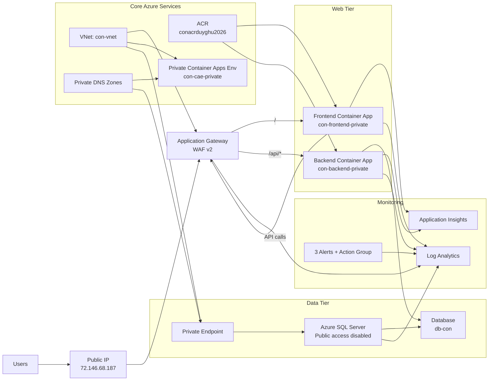

# Architecture Diagram

## Notes

- Users access the app only through the Application Gateway public IP.
- Application Gateway routes `/` to the frontend and `/api/*` to the backend.
- Frontend and backend run inside the private Container Apps environment.
- Azure SQL is private and connected through a private endpoint.
- ACR stores the container images used by both apps.
- Monitoring includes Log Analytics, Application Insights, health probes, and alert rules.
