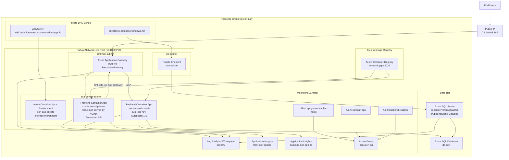

# Architecture Diagram

## Notes

- Only the Application Gateway public IP is intended as the user entry point.
- Application Gateway routes `/` to the frontend and `/api/*` to the backend.
- The frontend and backend run in the private Container Apps environment `con-cae-private`.
- Azure SQL is protected with a private endpoint and public network access is disabled.
- Images are built in Azure Container Registry and deployed to Container Apps.
- Monitoring is provided with Log Analytics, Application Insights, health probes, and alert rules.
