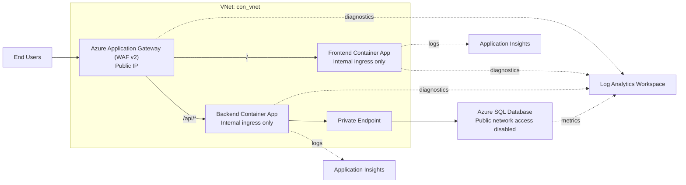

# Week 6 Submission Guide

This project is a valid three-tier app for the Azure assignment, with one important clarification:

- The repository frontend is a React SPA, not Next.js.
- The architecture and security goals still map cleanly to the coursework.

## 1. Architecture You Can Submit



## 2. What To Say About Each Tier

- Web tier: Azure Application Gateway is the only public entry point.
- App tier: frontend and backend run as separate internal-only services.
- Data tier: Azure SQL is private-only through a Private Endpoint and Private DNS.

## 3. Routing Requirement

- `/` goes to the frontend.
- `/api/*` goes to the backend.
- No direct public access to frontend, backend, or SQL.

For local Docker, this repo now mirrors that split by proxying `/api/*` from the frontend container to the backend container.

## 4. Azure Services To Show In Screenshots

- Resource Group
- Virtual Network and subnets
- Application Gateway (WAF v2)
- Frontend Container App
- Backend Container App
- Azure SQL Server and Database
- Private Endpoint
- Private DNS Zone
- NSGs
- Application Insights
- Log Analytics Workspace
- Alert rules
- Action Group

## 5. Acceptance Criteria Evidence

- Architecture diagram
- Application Gateway backend health showing both targets healthy
- Frontend homepage loading through the Application Gateway public IP or DNS
- API call working through `https://<gateway>/api/products`
- Azure SQL public network access set to disabled
- Frontend and backend not directly publicly reachable
- At least 3 alerts configured

## 6. Suggested Alerts

- Application Gateway unhealthy host count greater than 0
- Backend container restart count greater than 0
- Azure SQL high CPU usage or DTU/vCore utilization

## 7. Functional Test Flow

1. Open the homepage through the Application Gateway URL.
2. Register or log in.
3. Load products from `/api/products`.
4. Add an item to cart.
5. Create an order.
6. Confirm data is written to and read from Azure SQL.

## 8. Local Docker Note

Before running Docker Compose, create a root `.env` file with:

```env
DB_SERVER=<your-sql-server-private-fqdn-or-test-server>
DB_NAME=db-con
DB_USER=<your-user>
DB_PASSWORD=<your-password>
JWT_SECRET=<strong-secret>
```

Then run:

```bash
docker compose up --build
```

## 9. What Changed In This Repo

- Fixed local Docker path-based routing so the frontend can forward `/api/*` to the backend container.
- Removed a misleading frontend runtime env var from Docker Compose that would not affect a static React build.
